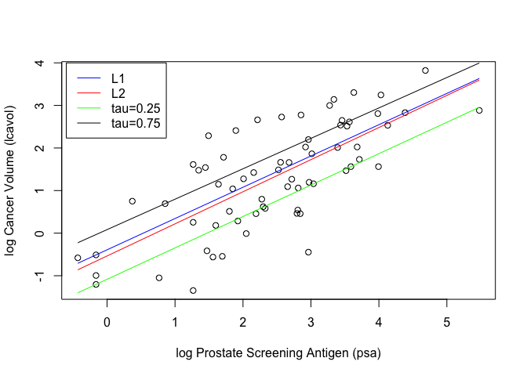

Homework 1
================
Qianyi Sun
January 20, 2020

``` r
library('ElemStatLearn')

## load prostate data

data("prostate")

## subset to training examples
prostate_train <- subset(prostate, train==TRUE)

## plot lcavol vs lpsa
plot_psa_data <- function(dat=prostate_train) {
  plot(dat$lpsa, dat$lcavol,
       xlab="log Prostate Screening Antigen (psa)",
       ylab="log Cancer Volume (lcavol)")
}
plot_psa_data()
##  L1  loss function
L1_loss <- function(y, yhat)
  abs(y -yhat)

## L2 loss function
L2_loss <- function(y, yhat)
  (y-yhat)^2
## tau = 0.25
Tilted_absolute_loss_0.25<-function(y, yhat){
ifelse(y-yhat > 0, 0.25*(y-yhat), -0.75*(y-yhat))
}
## tau = 0.75
Tilted_absolute_loss_0.75<-function(y, yhat){
ifelse(y-yhat > 0, 0.75*(y-yhat), -0.25*(y-yhat))
}
## fit simple linear model using numerical optimization with L1_loss
fit_lin <- function(y, x, loss=L1_loss, beta_init = c(-0.51, 0.75)) {
  err <- function(beta)                
    mean(loss(y,  beta[1] + beta[2]*x))
  beta <- optim(par = beta_init, fn = err)
  return(beta)
}


## make predictions from linear model
predict_lin <- function(x, beta)
  beta[1] + beta[2]*x


## fit linear model with L1_loss
lin_beta_L1 <- fit_lin(y=prostate_train$lcavol,
                    x=prostate_train$lpsa,
                    loss=L1_loss)

## fit linear model with L2_loss
lin_beta_L2 <- fit_lin(y=prostate_train$lcavol,
                    x=prostate_train$lpsa,
                    loss=L2_loss) 
## fit linear model with tau = 0.25
lin_beta2_tau_0.25 <- fit_lin(y=prostate_train$lcavol,
                    x=prostate_train$lpsa,
                    loss=Tilted_absolute_loss_0.25)
## fit linear model with tau = 0.75
lin_beta2_tau_0.75 <- fit_lin(y=prostate_train$lcavol,
                    x=prostate_train$lpsa,
                    loss=Tilted_absolute_loss_0.75)

## compute predictions for a grid of inputs
x_grid <- seq(min(prostate_train$lpsa),
              max(prostate_train$lpsa),
              length.out=100)
lin_pred <- predict_lin(x=x_grid, beta=lin_beta_L1$par) 
lin_pred1 <- predict_lin(x=x_grid, beta=lin_beta_L2$par)
lin_pred2 <- predict_lin(x=x_grid, beta=lin_beta2_tau_0.25$par)
lin_pred3 <- predict_lin(x=x_grid, beta=lin_beta2_tau_0.75$par)
## plot data
plot_psa_data()

## plot predictions
lines(x=x_grid, y=lin_pred, col = 'blue')  
lines(x=x_grid, y=lin_pred1, col = 'red')
lines(x=x_grid, y=lin_pred2, col = 'green')
lines(x=x_grid, y=lin_pred3, col = 'orange')
legend(-0.6, 4, legend = c("L1", "L2", "tau=0.25", "tau=0.75"), col=c("blue", "red", "green", "orange"), lty=1)
```

<!-- -->

``` r
## fit non-linear model using numerical optimization
fit_nonlin <- function(y, x, loss, beta_init = c(-1.0, 0.0, -0.3)) {
  err <- function(beta)
    mean(loss(y,  beta[1] + beta[2]*exp(-beta[3]*x)))
  beta <- optim(par = beta_init, fn = err)
  return(beta)
}

##  make predictions from non-linear model
predict_nonlin <- function(x, beta)
  beta[1] + beta[2]*exp(-beta[3]*x)

## fit non-linear model with L1_loss
nonlin_beta_L1 <- fit_nonlin(y=prostate_train$lcavol,
                    x=prostate_train$lpsa,
                    loss=L1_loss)

## fit non-linear model with L2_loss
nonlin_beta_L2 <- fit_nonlin(y=prostate_train$lcavol,
                    x=prostate_train$lpsa,
                    loss=L2_loss) 
## fit non-linear model with tau = 0.25
nonlin_beta2_tau_0.25 <- fit_nonlin(y=prostate_train$lcavol,
                    x=prostate_train$lpsa,
                    loss=Tilted_absolute_loss_0.25)
## fit non-linear model with tau = 0.75
nonlin_beta2_tau_0.75 <- fit_nonlin(y=prostate_train$lcavol,
                    x=prostate_train$lpsa,
                    loss=Tilted_absolute_loss_0.75)

## compute predictions for a grid of inputs

nonlin_pred <- predict_nonlin(x=x_grid, beta=nonlin_beta_L1$par) 
nonlin_pred1 <- predict_nonlin(x=x_grid, beta=nonlin_beta_L2$par)
nonlin_pred2 <- predict_nonlin(x=x_grid, beta=nonlin_beta2_tau_0.25$par)
nonlin_pred3 <- predict_nonlin(x=x_grid, beta=nonlin_beta2_tau_0.75$par)

## plot data
plot_psa_data()

## plot predictions
lines(x=x_grid, y=nonlin_pred, col = 'blue')  
lines(x=x_grid, y=nonlin_pred1, col = 'red')
lines(x=x_grid, y=nonlin_pred2, col = 'green')
lines(x=x_grid, y=nonlin_pred3, col = 'orange')
legend(-0.6, 4, legend = c("L1", "L2", "tau=0.25", "tau=0.75"), col=c("blue", "red", "green", "orange"), lty=1)
```

<!-- -->
