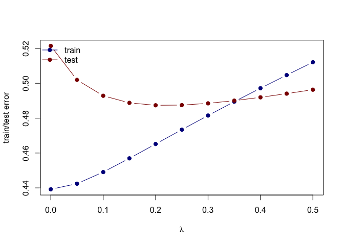

Homework 2
================
Qianyi Sun
February 5, 2020

# Install library

``` r
library('ElemStatLearn')  ## for 'prostate'
library('splines')        ## for 'bs'
library('dplyr')          ## for 'select', 'filter', and others
```

    ## 
    ## Attaching package: 'dplyr'

    ## The following objects are masked from 'package:stats':
    ## 
    ##     filter, lag

    ## The following objects are masked from 'package:base':
    ## 
    ##     intersect, setdiff, setequal, union

``` r
library('magrittr')       ## for '%<>%' operator
library('glmnet')         ## for 'glmnet'
```

    ## Loading required package: Matrix

    ## Loaded glmnet 3.0-2

``` r
data('prostate')
cor(prostate)
```

    ##              lcavol      lweight       age         lbph         svi
    ## lcavol   1.00000000  0.280521386 0.2249999  0.027349703  0.53884500
    ## lweight  0.28052139  1.000000000 0.3479691  0.442264395  0.15538491
    ## age      0.22499988  0.347969112 1.0000000  0.350185896  0.11765804
    ## lbph     0.02734970  0.442264395 0.3501859  1.000000000 -0.08584324
    ## svi      0.53884500  0.155384906 0.1176580 -0.085843238  1.00000000
    ## lcp      0.67531048  0.164537146 0.1276678 -0.006999431  0.67311118
    ## gleason  0.43241706  0.056882099 0.2688916  0.077820447  0.32041222
    ## pgg45    0.43365225  0.107353790 0.2761124  0.078460018  0.45764762
    ## lpsa     0.73446033  0.433319385 0.1695928  0.179809404  0.56621822
    ## train   -0.04654347 -0.009940651 0.1776155 -0.029939957  0.02679950
    ##                  lcp     gleason      pgg45        lpsa        train
    ## lcavol   0.675310484  0.43241706 0.43365225  0.73446033 -0.046543468
    ## lweight  0.164537146  0.05688210 0.10735379  0.43331939 -0.009940651
    ## age      0.127667752  0.26889160 0.27611245  0.16959284  0.177615517
    ## lbph    -0.006999431  0.07782045 0.07846002  0.17980940 -0.029939957
    ## svi      0.673111185  0.32041222 0.45764762  0.56621822  0.026799505
    ## lcp      1.000000000  0.51483006 0.63152825  0.54881317 -0.037427296
    ## gleason  0.514830063  1.00000000 0.75190451  0.36898681 -0.044171456
    ## pgg45    0.631528246  0.75190451 1.00000000  0.42231586  0.100516371
    ## lpsa     0.548813175  0.36898681 0.42231586  1.00000000 -0.033889743
    ## train   -0.037427296 -0.04417146 0.10051637 -0.03388974  1.000000000

# Split prostate into testing and training subsets

``` r
prostate_train <- prostate %>%
  filter(train == TRUE) %>% 
  select(-train)

summary(prostate_train)
```

    ##      lcavol           lweight           age             lbph         
    ##  Min.   :-1.3471   Min.   :2.375   Min.   :41.00   Min.   :-1.38629  
    ##  1st Qu.: 0.4883   1st Qu.:3.330   1st Qu.:61.00   1st Qu.:-1.38629  
    ##  Median : 1.4679   Median :3.599   Median :65.00   Median :-0.05129  
    ##  Mean   : 1.3135   Mean   :3.626   Mean   :64.75   Mean   : 0.07144  
    ##  3rd Qu.: 2.3491   3rd Qu.:3.884   3rd Qu.:69.00   3rd Qu.: 1.54751  
    ##  Max.   : 3.8210   Max.   :4.780   Max.   :79.00   Max.   : 2.32630  
    ##       svi              lcp             gleason          pgg45       
    ##  Min.   :0.0000   Min.   :-1.3863   Min.   :6.000   Min.   :  0.00  
    ##  1st Qu.:0.0000   1st Qu.:-1.3863   1st Qu.:6.000   1st Qu.:  0.00  
    ##  Median :0.0000   Median :-0.7985   Median :7.000   Median : 15.00  
    ##  Mean   :0.2239   Mean   :-0.2142   Mean   :6.731   Mean   : 26.27  
    ##  3rd Qu.:0.0000   3rd Qu.: 0.9948   3rd Qu.:7.000   3rd Qu.: 50.00  
    ##  Max.   :1.0000   Max.   : 2.6568   Max.   :9.000   Max.   :100.00  
    ##       lpsa        
    ##  Min.   :-0.4308  
    ##  1st Qu.: 1.6673  
    ##  Median : 2.5688  
    ##  Mean   : 2.4523  
    ##  3rd Qu.: 3.3652  
    ##  Max.   : 5.4775

``` r
prostate_test <- prostate %>%
  filter(train == FALSE) %>% 
  select(-train)
```

# Fit the model

``` r
fit <- lm(lpsa ~ ., data=prostate_train)
```

# Use the testing subset to compute the test error using the fitted least-squares regression model.

``` r
L2_loss <- function(y, yhat)
  (y-yhat)^2
error <- function(dat, fit, loss=L2_loss)
  mean(loss(dat$lpsa, predict(fit, newdata=dat)))
error(prostate_test, fit)
```

    ## [1] 0.521274

# Train a ridge regression model using the glmnet function, and tune the value of lambda.

``` r
form  <- lpsa ~ 0 + lweight + age + lbph + lcp + pgg45 + lcavol + svi + gleason
x_inp <- model.matrix(form, data=prostate_train)
y_out <- prostate_train$lpsa
fit <- glmnet(x=x_inp, y=y_out, lambda=seq(0.5, 0, -0.05),alpha = 0)
print(fit$beta)
```

    ## 8 x 11 sparse Matrix of class "dgCMatrix"

    ##    [[ suppressing 11 column names 's0', 's1', 's2' ... ]]

    ##                                                                          
    ## lweight  0.515697286  0.525400575  0.5354170019  0.545775814  0.556311619
    ## age     -0.004889276 -0.005637483 -0.0064660393 -0.007390172 -0.008436051
    ## lbph     0.111264821  0.113946024  0.1167762533  0.119749176  0.122883708
    ## lcp      0.015168605  0.007943168 -0.0003765233 -0.010208916 -0.022217776
    ## pgg45    0.004390331  0.004515174  0.0046637167  0.004840594  0.005062742
    ## lcavol   0.329947512  0.341656357  0.3545916725  0.369018247  0.385454679
    ## svi      0.541710372  0.553480497  0.5659053246  0.579302886  0.594067995
    ## gleason  0.063402833  0.061373728  0.0588793776  0.055915056  0.052224299
    ##                                                                         
    ## lweight  0.567083034  0.577904675  0.588577079  0.598728953  0.607640794
    ## age     -0.009617693 -0.010968049 -0.012524059 -0.014335139 -0.016468427
    ## lbph     0.126178477  0.129642591  0.133272193  0.137050755  0.140935937
    ## lcp     -0.036796539 -0.054965954 -0.078076538 -0.108262379 -0.149116876
    ## pgg45    0.005340520  0.005702607  0.006189804  0.006872589  0.007882003
    ## lcavol   0.404236189  0.426145259  0.452197566  0.483962606  0.524027412
    ## svi      0.610303587  0.628512630  0.649279407  0.673464940  0.702375090
    ## gleason  0.047591554  0.041501934  0.033149650  0.021047902  0.002236316
    ##                     
    ## lweight  0.613980850
    ## age     -0.019008894
    ## lbph     0.144825646
    ## lcp     -0.206830251
    ## pgg45    0.009471377
    ## lcavol   0.576765946
    ## svi      0.737805454
    ## gleason -0.029463345

# Create a path diagram of the ridge regression analysis

``` r
plot(x=range(fit$lambda),
     y=range(as.matrix(fit$beta)),
     type='n',
     xlab=expression(lambda),
     ylab='Coefficients')
for(i in 1:nrow(fit$beta)) {
  points(x=fit$lambda, y=fit$beta[i,], pch=19, col='#00000055')
  lines(x=fit$lambda, y=fit$beta[i,], col='#00000055')
}
abline(h=0, lty=3, lwd=2)
```

<!-- -->

# Create a figure that shows the training and test error associated with ridge regression as a function of lambda

``` r
error <- function(dat, fit, lam, form, loss=L2_loss) {
  x_inp <- model.matrix(form, data=dat)
  y_out <- dat$lpsa
  y_hat <- predict(fit, newx=x_inp, s=lam)  ## see predict.elnet
  mean(loss(y_out, y_hat))
}

## compute training and testing errors as function of lambda
err_train_1 <- sapply(fit$lambda, function(lam) 
  error(prostate_train, fit, lam, form))
err_test_1 <- sapply(fit$lambda, function(lam) 
  error(prostate_test, fit, lam, form))

## plot test/train error
plot(x=range(fit$lambda),
     y=range(c(err_train_1, err_test_1)),
     type='n',
     xlab=expression(lambda),
     ylab='train/test error')
points(fit$lambda, err_train_1, pch=19, type='b', col='darkblue')
points(fit$lambda, err_test_1, pch=19, type='b', col='darkred')
legend('topleft', c('train','test'), lty=1, pch=19,
       col=c('darkblue','darkred'), bty='n')
```

<!-- -->

``` r
colnames(fit$beta) <- paste('lam =', fit$lambda)
print(fit$beta %>% as.matrix)
```

    ##            lam = 0.5   lam = 0.45     lam = 0.4   lam = 0.35    lam = 0.3
    ## lweight  0.515697286  0.525400575  0.5354170019  0.545775814  0.556311619
    ## age     -0.004889276 -0.005637483 -0.0064660393 -0.007390172 -0.008436051
    ## lbph     0.111264821  0.113946024  0.1167762533  0.119749176  0.122883708
    ## lcp      0.015168605  0.007943168 -0.0003765233 -0.010208916 -0.022217776
    ## pgg45    0.004390331  0.004515174  0.0046637167  0.004840594  0.005062742
    ## lcavol   0.329947512  0.341656357  0.3545916725  0.369018247  0.385454679
    ## svi      0.541710372  0.553480497  0.5659053246  0.579302886  0.594067995
    ## gleason  0.063402833  0.061373728  0.0588793776  0.055915056  0.052224299
    ##           lam = 0.25    lam = 0.2   lam = 0.15    lam = 0.1   lam = 0.05
    ## lweight  0.567083034  0.577904675  0.588577079  0.598728953  0.607640794
    ## age     -0.009617693 -0.010968049 -0.012524059 -0.014335139 -0.016468427
    ## lbph     0.126178477  0.129642591  0.133272193  0.137050755  0.140935937
    ## lcp     -0.036796539 -0.054965954 -0.078076538 -0.108262379 -0.149116876
    ## pgg45    0.005340520  0.005702607  0.006189804  0.006872589  0.007882003
    ## lcavol   0.404236189  0.426145259  0.452197566  0.483962606  0.524027412
    ## svi      0.610303587  0.628512630  0.649279407  0.673464940  0.702375090
    ## gleason  0.047591554  0.041501934  0.033149650  0.021047902  0.002236316
    ##              lam = 0
    ## lweight  0.613980850
    ## age     -0.019008894
    ## lbph     0.144825646
    ## lcp     -0.206830251
    ## pgg45    0.009471377
    ## lcavol   0.576765946
    ## svi      0.737805454
    ## gleason -0.029463345
