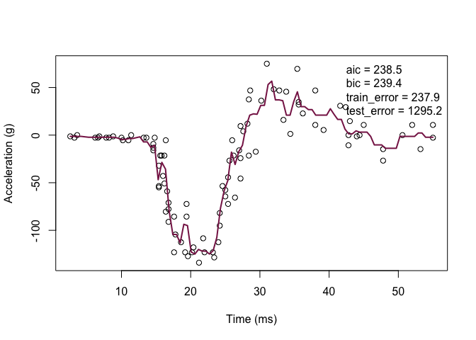

Homework 3
================
Qianyi Sun
March 19, 2020

``` r
library('MASS') ## for 'mcycle'
library('manipulate') ## for 'manipulate'
```

Randomly split the mcycle data into training (75%) and validation (25%)
subsets.

``` r
set.seed(101) # Set Seed so that same sample can be reproduced in future also
# Now Selecting 75% of data as sample from total 'n' rows of the data  
sample <- sample.int(n = nrow(mcycle), size = floor(.75*nrow(mcycle)), replace = F)
train <- mcycle[sample, ]
test  <- mcycle[-sample, ]
```

Using the mcycle data, consider predicting the mean acceleration as a
function of time. Use the Nadaraya-Watson method with the k-NN kernel
function to create a series of prediction models by varying the tuning
parameter over a sequence of values.

``` r
y <- train$accel
x <- matrix(train$times, length(train$times), 1)

y_test <- test$accel
x_test <- matrix(test$times, length(test$times), 1)
```

``` r
## k-NN kernel function
## x  - n x p matrix of training inputs
## x0 - 1 x p input where to make prediction
## k  - number of nearest neighbors
kernel_k_nearest_neighbors <- function(x, x0, k=1) {
  ## compute distance betwen each x and x0
  z <- t(t(x) - x0)
  d <- sqrt(rowSums(z*z))
  
  ## initialize kernel weights to zero
  w <- rep(0, length(d))
  
  ## set weight to 1 for k nearest neighbors
  w[order(d)[1:k]] <- 1
  
  return(w)
}
```

``` r
## Make predictions using the NW method
## y  - n x 1 vector of training outputs
## x  - n x p matrix of training inputs
## x0 - m x p matrix where to make predictions
## kern  - kernel function to use
## ... - arguments to pass to kernel function
nadaraya_watson <- function(y, x, x0, kern, ...) {
  k <- t(apply(x0, 1, function(x0_) {
    k_ <- kern(x, x0_, ...)
    k_/sum(k_)
  }))
  yhat <- drop(k %*% y)
  attr(yhat, 'k') <- k
  return(yhat)
}
```

``` r
## Compute effective df using NW method
## y  - n x 1 vector of training outputs
## x  - n x p matrix of training inputs
## kern  - kernel function to use
## ... - arguments to pass to kernel function
effective_df <- function(y, x, kern, ...) {
  y_hat <- nadaraya_watson(y, x, x,
                           kern=kern, ...)
  sum(diag(attr(y_hat, 'k')))
}
```

make predictions using NW method at training inputs

``` r
y_hat <- nadaraya_watson(y, x, x,kern=kernel_k_nearest_neighbors, k=2)
edf <- effective_df(y, x, 
 kern=kernel_k_nearest_neighbors, k=2)
```

``` r
y_hat <- nadaraya_watson(y, x, x,kern=kernel_k_nearest_neighbors, k=3)
edf <- effective_df(y, x, 
 kern=kernel_k_nearest_neighbors, k=3)
```

``` r
y_hat_test <- nadaraya_watson(y, x, x_test,kern=kernel_k_nearest_neighbors, k=3)
```

With the squared-error loss function, compute and plot the training
error, AIC, BIC, and validation error (using the validation data) as
functions of the tuning parameter.

``` r
## loss function
## y    - train/test y
## yhat - predictions at train/test x
loss_squared_error <- function(y, yhat)
  (y - yhat)^2

## train error
## y    - train/test y
## yhat - predictions at train x
## loss - loss function
error <- function(y, yhat, loss=loss_squared_error)
  mean(loss(y, yhat))


## AIC
## y    - training y
## yhat - predictions at training x
## d    - effective degrees of freedom
aic <- function(y, yhat, d)
  error(y, yhat) + 2/length(y)*d

## BIC
## y    - training y
## yhat - predictions at training x
## d    - effective degrees of freedom
bic <- function(y, yhat, d)
  error(y, yhat) + log(length(y))/length(y)*d
```

# 

``` r
train_error<-error(y,y_hat)
test_error<-error(y_test,y_hat_test)
AIC<-aic(y, y_hat, edf)
BIC<-bic(y, y_hat, edf)

## create a grid of inputs 
x_plot <- matrix(seq(min(x),max(x),length.out=100),100,1)

## make predictions using NW method at each of grid points
y_hat_plot <- nadaraya_watson(y, x, x_plot,
                              kern=kernel_k_nearest_neighbors, k=3)

plot(x, y, xlab="Time (ms)", ylab="Acceleration (g)")
legend('topright', legend = c(
paste0('aic = ', round(AIC, 1)),
paste0('bic = ', round(BIC, 1)),
paste0('train_error = ', round(train_error, 1)),
paste0('test_error = ', round(test_error, 1))),
 bty='n')
lines(x_plot, y_hat_plot, col="#882255", lwd=2) 
```

<!-- -->

``` r
library('manipulate')
library('splines') ## 'ns'
library('caret')
```

    ## Loading required package: lattice

    ## Loading required package: ggplot2

For each value of the tuning parameter, Perform 5-fold cross-validation
using the combined training and validation data. This results in 5
estimates of test error per tuning parameter value.

``` r
## 5-fold cross-validation of knnreg model
## create five folds
set.seed(1985)
mcycle_flds  <- createFolds(mcycle$accel, k=5)
print(mcycle_flds)
```

    ## $Fold1
    ##  [1]   8  21  25  26  28  31  35  39  41  42  65  69  71  73  77  80  88
    ## [18]  98 101 102 108 109 116 128 129 130
    ## 
    ## $Fold2
    ##  [1]  11  12  15  16  17  23  32  44  47  49  51  55  57  68  75  79  82
    ## [18]  90  92  99 107 110 113 117 119 121 123 125
    ## 
    ## $Fold3
    ##  [1]   2  10  18  19  34  36  38  45  46  50  54  58  63  64  81  84  85
    ## [18]  86  87  89  93  97 115 118 124 132
    ## 
    ## $Fold4
    ##  [1]   3   6   7  14  20  24  27  29  33  40  43  48  56  59  60  66  74
    ## [18]  78  91  94  96 104 106 122 126 127 131
    ## 
    ## $Fold5
    ##  [1]   1   4   5   9  13  22  30  37  52  53  61  62  67  70  72  76  83
    ## [18]  95 100 103 105 111 112 114 120 133

``` r
sapply(mcycle_flds, length)  ## not all the same length
```

    ## Fold1 Fold2 Fold3 Fold4 Fold5 
    ##    26    28    26    27    26

``` r
cvknnreg <- function(kNN = 10, flds=mcycle_flds) {
  cverr <- rep(NA, length(flds))
  for(tst_idx in 1:length(flds)) { ## for each fold
    
    ## get training and testing data
    mcycle_trn <- mcycle[-flds[[tst_idx]],]
    mcycle_tst <- mcycle[ flds[[tst_idx]],]
    
    ## fit kNN model to training data
    knn_fit <- knnreg(accel ~ times,
                      k=kNN, data=mcycle_trn)
    
    ## compute test error on testing data
    pre_tst <- predict(knn_fit, mcycle_tst)
    cverr[tst_idx] <- mean((mcycle_tst$accel - pre_tst)^2)
  }
  return(cverr)
}
```

Plot the CV-estimated test error (average of the five estimates from
each fold) as a function of the tuning parameter. Add vertical line
segments to the figure (using the segments function in R) that represent
one “standard error” of the CV-estimated test error (standard deviation
of the five estimates from each fold).

``` r
## Compute 5-fold CV for kNN = 1:20
cverrs <- sapply(1:20, cvknnreg)
print(cverrs) ## rows are k-folds (1:5), cols are kNN (1:20)
```

    ##           [,1]      [,2]      [,3]      [,4]      [,5]     [,6]     [,7]
    ## [1,] 1662.9777 1200.0656 1140.7323 1139.9682 1072.4565 871.8225 902.6736
    ## [2,] 1233.9254  719.7545  414.6529  406.2720  392.1644 388.9737 356.7845
    ## [3,]  950.2992  743.4935  767.2904  790.7059  837.1636 746.2646 699.6566
    ## [4,] 1066.6833  939.3517  966.4693  819.2197  762.0736 739.3821 755.9211
    ## [5,]  829.5536  866.2058  847.8847  786.1484  698.5016 718.3772 647.9664
    ##          [,8]     [,9]    [,10]    [,11]    [,12]    [,13]    [,14]
    ## [1,] 865.9440 881.9663 905.4154 918.8290 879.4212 870.7356 893.7753
    ## [2,] 398.2982 437.8430 435.3835 468.2931 458.9995 420.2574 406.9754
    ## [3,] 665.1589 684.4300 707.7291 699.0208 723.3589 726.6567 696.9062
    ## [4,] 773.0690 753.5173 732.2657 693.2659 707.9107 712.3221 680.9196
    ## [5,] 654.7812 582.7061 580.6095 591.8443 580.9938 586.1192 588.1546
    ##         [,15]    [,16]    [,17]    [,18]    [,19]    [,20]
    ## [1,] 948.6905 923.3845 940.7557 996.8310 952.1598 965.4597
    ## [2,] 374.1702 382.4026 405.5556 419.2063 417.0465 417.9231
    ## [3,] 714.1368 767.9444 755.3994 754.1490 781.4413 868.3828
    ## [4,] 676.9464 678.1938 684.7731 737.2583 773.9589 840.3452
    ## [5,] 575.1274 600.3366 618.1128 656.5049 666.6291 688.6101

``` r
cverrs_mean <- apply(cverrs, 2, mean)
cverrs_sd   <- apply(cverrs, 2, sd)

## Plot the results of 5-fold CV for kNN = 1:20
plot(x=1:20, y=cverrs_mean, 
     ylim=range(cverrs),
     xlab="'k' in kNN", ylab="CV Estimate of Test Error")
segments(x0=1:20, x1=1:20,
         y0=cverrs_mean-cverrs_sd,
         y1=cverrs_mean+cverrs_sd)
best_idx <- which.min(cverrs_mean)
points(x=best_idx, y=cverrs_mean[best_idx], pch=20)
abline(h=cverrs_mean[best_idx] + cverrs_sd[best_idx], lty=3)
```

<!-- -->

erpret the resulting figures and select a suitable value for the tuning
parameter.

We can find that with the increase of ‘k’ in kNN, the CV-estimated test
error, to some extent, decreases. When k is 14, the CV-estimated test
error is minimal. However, with the increase of ‘k’ in kNN, the model’s
bias is increased and its variance is decreased. Thus, for trade\_off
prinpal, k is 10 that might be a suitable value for the tuning
parameter. Because when k is 10, the model complexity is not so high and
its test error is small.
