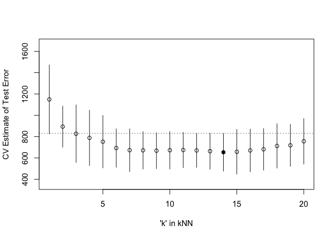

Homework 3
================
Qianyi Sun
March 19, 2020

``` r
library(dplyr)
```

    ## 
    ## Attaching package: 'dplyr'

    ## The following objects are masked from 'package:stats':
    ## 
    ##     filter, lag

    ## The following objects are masked from 'package:base':
    ## 
    ##     intersect, setdiff, setequal, union

``` r
library(tidyverse)
```

    ## ── Attaching packages ───────────────────────────────────────────────────────────────────────────────── tidyverse 1.2.1 ──

    ## ✔ ggplot2 3.2.1     ✔ readr   1.3.1
    ## ✔ tibble  2.1.3     ✔ purrr   0.3.2
    ## ✔ tidyr   1.0.0     ✔ stringr 1.4.0
    ## ✔ ggplot2 3.2.1     ✔ forcats 0.4.0

    ## ── Conflicts ──────────────────────────────────────────────────────────────────────────────────── tidyverse_conflicts() ──
    ## ✖ dplyr::filter() masks stats::filter()
    ## ✖ dplyr::lag()    masks stats::lag()

``` r
library('MASS') ## for 'mcycle'
```

    ## 
    ## Attaching package: 'MASS'

    ## The following object is masked from 'package:dplyr':
    ## 
    ##     select

``` r
library('manipulate') ## for 'manipulate'
```

# Randomly split the mcycle data into training (75%) and validation (25%) subsets.

``` r
set.seed(101) # Set Seed so that same sample can be reproduced in future also
# Now Selecting 75% of data as sample from total 'n' rows of the data  
sample <- sample.int(n = nrow(mcycle), size = floor(.75*nrow(mcycle)), replace = F)
train <- mcycle[sample, ]
test  <- mcycle[-sample, ]


train_y <- train$accel
train_x <- matrix(train$times, length(train$times), 1)
test_y <- test$accel
test_x <- matrix(test$times, length(test$times), 1)
```

# Using the mcycle data, consider predicting the mean acceleration as a function of time. Use the Nadaraya-Watson method with the k-NN kernel function to create a series of prediction models by varying the tuning parameter over a sequence of values.

``` r
# create input
x_plot <- matrix(seq(min(train_x),max(train_x),length.out=100),100,1)
```

``` r
## k-NN kernel function
## x  - n x p matrix of training inputs
## x0 - 1 x p input where to make prediction
## k  - number of nearest neighbors
kernel_k_nearest_neighbors <- function(x, x0, k=1) {
  ## compute distance betwen each x and x0
  z <- t(t(x) - x0)
  d <- sqrt(rowSums(z*z))
  
  ## initialize kernel weights to zero
  w <- rep(0, length(d))
  
  ## set weight to 1 for k nearest neighbors
  w[order(d)[1:k]] <- 1
  
  return(w)
}
```

``` r
## Make predictions using the NW method
## y  - n x 1 vector of training outputs
## x  - n x p matrix of training inputs
## x0 - m x p matrix where to make predictions
## kern  - kernel function to use
## ... - arguments to pass to kernel function
nadaraya_watson <- function(y, x, x0, kern, ...) {
  k <- t(apply(x0, 1, function(x0_) {
    k_ <- kern(x, x0_, ...)
    k_/sum(k_)
  }))
  yhat <- drop(k %*% y)
  attr(yhat, 'k') <- k
  return(yhat)
}
```

``` r
## Compute effective df using NW method
## y  - n x 1 vector of training outputs
## x  - n x p matrix of training inputs
## kern  - kernel function to use
## ... - arguments to pass to kernel function
effective_df <- function(y, x, kern, ...) {
  y_hat <- nadaraya_watson(y, x, x,
                           kern=kern, ...)
  sum(diag(attr(y_hat, 'k')))
}

## loss function
## y    - train/test y
## yhat - predictions at train/test x
loss_squared_error <- function(y, yhat)
  (y - yhat)^2

## train/test error
## y    - train/test y
## yhat - predictions at train x
## loss - loss function
error <- function(y, yhat, loss=loss_squared_error)
  mean(loss(y, yhat))


## AIC
## y    - training y
## yhat - predictions at training x
## d    - effective degrees of freedom
aic <- function(y, yhat, d)
  error(y, yhat) + 2/length(y)*d

## BIC
## y    - training y
## yhat - predictions at training x
## d    - effective degrees of freedom
bic <- function(y, yhat, d)
  error(y, yhat) + log(length(y))/length(y)*d
```

``` r
## create sequence to store the training error, AIC, BIC, and validation error
AIC <- rep(NA, 50)
BIC <- rep(NA, 50)
train_error <- rep(NA, 50)
test_error <- rep(NA, 50)
```

# make predictions using NW method at training inputs

``` r
for(i in seq(1,50,1)){
  y_hat_train <- nadaraya_watson(train_y, train_x, train_x, kern = kernel_k_nearest_neighbors, k=i)
  y_hat_valid <- nadaraya_watson(train_y, train_x, test_x, kern = kernel_k_nearest_neighbors, k = i)
  edf <- effective_df(train_y, train_x, kern = kernel_k_nearest_neighbors, k = i)
  train_error[i] <- error(train_y, yhat = y_hat_train)
  AIC[i] <- aic(train_y, yhat = y_hat_train, d = edf)
  BIC[i] <- bic(train_y, yhat = y_hat_train, d = edf)
  test_error[i] <- error(test_y, yhat = y_hat_valid)
}
```

With the squared-error loss function, compute and plot the training
error, AIC, BIC, and validation error (using the validation data) as
functions of the tuning
parameter.

``` r
## plot the training and test errors, along with AIC and BIC, as a function of the tuning parameter k.
plot(train_error,type="b",xlab= 'K',ylab='Train error, test error, aic and bic')
lines(test_error,type="b",col="red") 
lines(AIC,type="b",col="green")
lines(BIC,type="b",col="blue")
legend('top', c('Train Error','Test Error','AIC','BIC'),col=c('black','red','green','blue'), bty='n',lty=2, pch=19)
```

<!-- -->

``` r
train_error
```

    ##  [1]  197.0458  182.7003  237.8585  274.1274  297.8374  314.9512  337.4763
    ##  [8]  349.7686  355.0846  361.9940  376.3778  395.2653  394.1047  399.7880
    ## [15]  419.8674  450.0747  478.8419  482.2701  500.6563  540.7163  565.2597
    ## [22]  623.9051  634.6575  659.5560  699.3450  744.9348  774.9235  826.2934
    ## [29]  861.7973  890.9974  946.0631  984.2076 1028.6073 1057.1037 1094.9272
    ## [36] 1121.8554 1161.1494 1189.6427 1241.0124 1282.2374 1335.1060 1379.2239
    ## [43] 1428.4497 1498.5750 1551.2841 1595.5394 1656.0280 1721.0339 1777.6307
    ## [50] 1827.2283

``` r
AIC
```

    ##  [1]  198.6215  183.6598  238.5252  274.6274  298.2374  315.2846  337.7620
    ##  [8]  350.0186  355.3068  362.1940  376.5596  395.4320  394.2585  399.9308
    ## [15]  420.0007  450.1997  478.9595  482.3813  500.7616  540.8163  565.3550
    ## [22]  623.9960  634.7445  659.6393  699.4250  745.0117  774.9976  826.3648
    ## [29]  861.8663  891.0641  946.1277  984.2701 1028.6679 1057.1625 1094.9844
    ## [36] 1121.9110 1161.2034 1189.6954 1241.0637 1282.2874 1335.1548 1379.2716
    ## [43] 1428.4963 1498.6205 1551.3285 1595.5829 1656.0705 1721.0756 1777.6715
    ## [50] 1827.2683

``` r
BIC
```

    ##  [1]  200.6662  184.9050  239.3902  275.2762  298.7564  315.7171  338.1328
    ##  [8]  350.3430  355.5952  362.4535  376.7955  395.6482  394.4582  400.1162
    ## [15]  420.1737  450.3619  479.1122  482.5254  500.8982  540.9460  565.4786
    ## [22]  624.1139  634.8573  659.7475  699.5288  745.1115  775.0937  826.4575
    ## [29]  861.9558  891.1506  946.2114  984.3512 1028.7466 1057.2388 1095.0585
    ## [36] 1121.9831 1161.2736 1189.7637 1241.1302 1282.3523 1335.2181 1379.3333
    ## [43] 1428.5566 1498.6795 1551.3862 1595.6393 1656.1257 1721.1297 1777.7245
    ## [50] 1827.3202

By oberserving the train\_error,AIC and BIC, we can know that the three
values are so approaching thus its lines are overlapped.

``` r
library('manipulate')
library('splines') ## 'ns'
library('caret')
```

    ## Loading required package: lattice

    ## 
    ## Attaching package: 'caret'

    ## The following object is masked from 'package:purrr':
    ## 
    ##     lift

For each value of the tuning parameter, Perform 5-fold cross-validation
using the combined training and validation data. This results in 5
estimates of test error per tuning parameter value.

``` r
## 5-fold cross-validation of knnreg model
## create five folds
set.seed(1985)
mcycle_flds  <- createFolds(mcycle$accel, k=5)
print(mcycle_flds)
```

    ## $Fold1
    ##  [1]   8  21  25  26  28  31  35  39  41  42  65  69  71  73  77  80  88
    ## [18]  98 101 102 108 109 116 128 129 130
    ## 
    ## $Fold2
    ##  [1]  11  12  15  16  17  23  32  44  47  49  51  55  57  68  75  79  82
    ## [18]  90  92  99 107 110 113 117 119 121 123 125
    ## 
    ## $Fold3
    ##  [1]   2  10  18  19  34  36  38  45  46  50  54  58  63  64  81  84  85
    ## [18]  86  87  89  93  97 115 118 124 132
    ## 
    ## $Fold4
    ##  [1]   3   6   7  14  20  24  27  29  33  40  43  48  56  59  60  66  74
    ## [18]  78  91  94  96 104 106 122 126 127 131
    ## 
    ## $Fold5
    ##  [1]   1   4   5   9  13  22  30  37  52  53  61  62  67  70  72  76  83
    ## [18]  95 100 103 105 111 112 114 120 133

``` r
sapply(mcycle_flds, length)
```

    ## Fold1 Fold2 Fold3 Fold4 Fold5 
    ##    26    28    26    27    26

``` r
cvknnreg <- function(kNN = 10, flds=mcycle_flds) {
  cverr <- rep(NA, length(flds))
  for(tst_idx in 1:length(flds)) { ## for each fold
    
    ## get training and testing data
    mcycle_trn <- mcycle[-flds[[tst_idx]],]
    mcycle_tst <- mcycle[ flds[[tst_idx]],]
    
    ## fit kNN model to training data
    knn_fit <- knnreg(accel ~ times,
                      k=kNN, data=mcycle_trn)
    
    ## compute test error on testing data
    pre_tst <- predict(knn_fit, mcycle_tst)
    cverr[tst_idx] <- mean((mcycle_tst$accel - pre_tst)^2)
  }
  return(cverr)
}
```

``` r
## Compute 5-fold CV for kNN = 1:25
cverrs <- sapply(1:25, cvknnreg)
print(cverrs)
```

    ##           [,1]      [,2]      [,3]      [,4]      [,5]     [,6]     [,7]
    ## [1,] 1662.9777 1200.0656 1140.7323 1139.9682 1072.4565 871.8225 902.6736
    ## [2,] 1233.9254  719.7545  414.6529  406.2720  392.1644 388.9737 356.7845
    ## [3,]  950.2992  743.4935  767.2904  790.7059  837.1636 746.2646 699.6566
    ## [4,] 1066.6833  939.3517  966.4693  819.2197  762.0736 739.3821 755.9211
    ## [5,]  829.5536  866.2058  847.8847  786.1484  698.5016 718.3772 647.9664
    ##          [,8]     [,9]    [,10]    [,11]    [,12]    [,13]    [,14]
    ## [1,] 865.9440 881.9663 905.4154 918.8290 879.4212 870.7356 893.7753
    ## [2,] 398.2982 437.8430 435.3835 468.2931 458.9995 420.2574 406.9754
    ## [3,] 665.1589 684.4300 707.7291 699.0208 723.3589 726.6567 696.9062
    ## [4,] 773.0690 753.5173 732.2657 693.2659 707.9107 712.3221 680.9196
    ## [5,] 654.7812 582.7061 580.6095 591.8443 580.9938 586.1192 588.1546
    ##         [,15]    [,16]    [,17]    [,18]    [,19]    [,20]     [,21]
    ## [1,] 948.6905 923.3845 940.7557 996.8310 952.1598 965.4597 1003.9442
    ## [2,] 374.1702 382.4026 405.5556 419.2063 417.0465 417.9231  406.0370
    ## [3,] 714.1368 767.9444 755.3994 754.1490 781.4413 868.3828  880.4458
    ## [4,] 676.9464 678.1938 684.7731 737.2583 773.9589 840.3452  868.7858
    ## [5,] 575.1274 600.3366 618.1128 656.5049 666.6291 688.6101  725.1959
    ##          [,22]     [,23]     [,24]     [,25]
    ## [1,] 1030.3948 1064.6790 1041.7612 1059.5064
    ## [2,]  434.7237  503.5738  517.2852  510.8153
    ## [3,]  893.5272  940.0699  947.8386  976.8820
    ## [4,]  923.7878  958.2058  978.4419 1001.0530
    ## [5,]  744.0833  799.1230  838.6625  860.4817

# Plot the CV-estimated test error (average of the five estimates from each fold) as a function of the tuning parameter.

``` r
cverrs_mean <- apply(cverrs, 2, mean)
cverrs_sd   <- apply(cverrs, 2, sd)

## Plot the results of 5-fold CV for kNN = 1:20
plot(x=1:25, y=cverrs_mean, 
     ylim=range(cverrs),
     xlab="'k' in kNN", ylab="CV Estimate of Test Error")
segments(x0=1:25, x1=1:25,
         y0=cverrs_mean-cverrs_sd,
         y1=cverrs_mean+cverrs_sd)
best_idx <- which.min(cverrs_mean)
points(x=best_idx, y=cverrs_mean[best_idx], pch=20)
abline(h=cverrs_mean[best_idx] + cverrs_sd[best_idx], lty=3)
```

<!-- -->

# Interpret the resulting figures and select a suitable value for the tuning parameter.

We all know that as k increases, the bias of the estimator will also
increase and its variance will decrease. From the graph, we can find
that when ‘k’ in kNN is between 1 and 14 with the increase of ‘k’ in
kNN, the CV-estimated test error, to some extent, decreases. I think the
good choice will be the minimal test error. Thus when k = 14, that might
be a good choice. But if we want to decide the k value by “one standard
error” rule, I think another suitable value will be 22 for k value. The
one standard error can help us find a model which can perfrom well in
different test dataset if we randomly choose.
